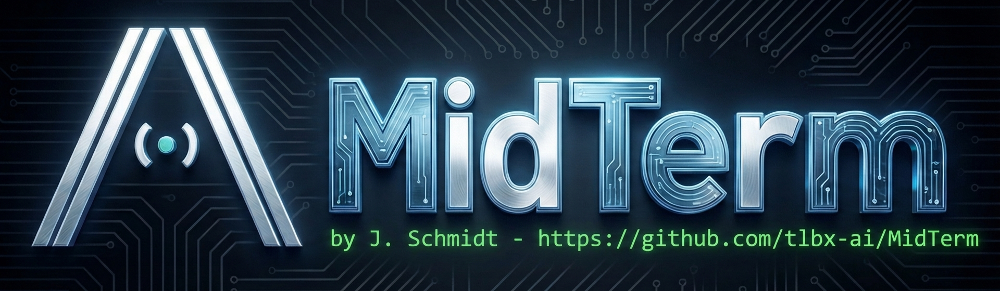

<p align="center">
  
</p>

# MidTerm

[](https://github.com/tlbx-ai/MidTerm/releases/latest)
[](https://www.gnu.org/licenses/agpl-3.0)
[](#install)
[](#install)
[](#install)

**Your terminal, anywhere.** Run AI agents on your machine. Check on them from your phone.


## The 30-Second Version

You start Claude Code on your PC. Complex refactor — it's going to take a while.

You need lunch. You grab your phone. You open MidTerm.

Your agent is still running. It's asking a question.

You type "yes, commit that." You go back to eating.

**That's MidTerm.** One binary. One password. Any browser.

## Install

Recommended for real installs: use the native installer below. It handles password setup, service mode, and self-update.

**macOS / Linux:**
```bash
curl -fsSL https://tlbx-ai.github.io/MidTerm/install.sh | bash
```

**Windows (PowerShell):**
```powershell
irm https://tlbx-ai.github.io/MidTerm/install.ps1 | iex
```

**Quick launch alternative via `npx` (requires Node.js):**
```bash
npx @tlbx-ai/midterm
```

That downloads the native binary for your platform, runs MidTerm in user mode, and opens it in your browser. Use the installer above if you want the normal persistent install and update path.

Open [https://localhost:2000](https://localhost:2000). Click **+**. You have a terminal.

The installer asks for a password — nobody gets in without it.

## Access From Anywhere

Install **[Tailscale](https://tailscale.com)** (free). Now open `http://your-machine:2000` from any device, anywhere.

<details>
<summary>Other options: Cloudflare Tunnel, reverse proxy</summary>

- **[Cloudflare Tunnel](https://developers.cloudflare.com/cloudflare-one/connections/connect-networks/)** — Free, no port forwarding needed
- **Reverse proxy** — nginx/Caddy with HTTPS

</details>

## What You Get

- **Single ~15MB binary.** No Docker. No Node. No runtime. Download and run.
- **Password protected from first run.** PBKDF2 hashed, rate-limited, not optional.
- **Any shell.** Zsh, Bash, PowerShell, CMD.
- **Multiple terminals, one browser tab.** Split panes, drag to reorder.
- **Works on any screen.** Phone, tablet, laptop — resize with one click.
- **Auto-updates.** One click in the UI, page reloads automatically.

<details>
<summary>More features</summary>

- **Native AOT compiled** — macOS, Windows, Linux
- **Priority multiplexing** — Active terminal gets instant delivery, background sessions batch efficiently
- **Tmux compatibility** — AI coding tools that detect tmux work out of the box
- **Manager bar** — Customizable quick-action buttons for common commands
- **Clipboard image paste** — Alt+V to inject clipboard images into terminal
- **Installable (PWA)** — Add to home screen on mobile, standalone window on desktop

</details>

## Perfect For

- **AI coding agents** — Claude Code, OpenAI Codex, Aider, Cursor CLI
- **Long-running tasks** — Builds, deployments, data processing
- **Any TUI app** — htop, vim, tmux sessions, whatever you run in a terminal

```
Your PC                          Anywhere
┌─────────────────┐              ┌─────────────────┐
│ Claude Code     │    HTTPS     │                 │
│ OpenAI Codex    │◄────────────►│   Browser       │
│ Any TUI app     │   WebSocket  │                 │
└─────────────────┘              └─────────────────┘
     Full power                    Full access
```

---

## Reference

<details>
<summary>Command line options</summary>

```
mm [options]

  --port 2000       Port to listen on (default: 2000)
  --bind 0.0.0.0    Address to bind to (default: 0.0.0.0)
  --version         Show version and exit
  --hash-password   Hash a password for settings.json
```

</details>

<details>
<summary>Configuration</summary>

Settings stored in:
- **Service mode:** `%ProgramData%\MidTerm\settings.json` (Windows) or `/usr/local/etc/MidTerm/settings.json` (Unix)
- **User mode:** `~/.MidTerm/settings.json`

```json
{
  "defaultShell": "Pwsh",
  "defaultCols": 120,
  "defaultRows": 30,
  "authenticationEnabled": true,
  "passwordHash": "$PBKDF2$100000$..."
}
```

</details>

<details>
<summary>Security details</summary>

- **PBKDF2 hashing** — 100,000 iterations with SHA256
- **Session cookies** — 3-week validity with sliding expiration
- **Rate limiting** — Lockout after failed login attempts
- Change your password anytime in **Settings > Security**

</details>

<details>
<summary>Installation options</summary>

The installer asks you to choose:

| Option | Best for | Privileges |
|--------|----------|------------|
| **System service** | Always-on access, headless machines, remote access before login | Requires admin/sudo |
| **User install** | Try it out, occasional use, no admin rights | No special permissions |

### Manual Download

| Platform | Download |
|----------|----------|
| macOS ARM64 | [mm-osx-arm64.tar.gz](https://github.com/tlbx-ai/MidTerm/releases/latest) |
| macOS x64 | [mm-osx-x64.tar.gz](https://github.com/tlbx-ai/MidTerm/releases/latest) |
| Windows x64 | [mm-win-x64.zip](https://github.com/tlbx-ai/MidTerm/releases/latest) |
| Linux x64 | [mm-linux-x64.tar.gz](https://github.com/tlbx-ai/MidTerm/releases/latest) |

</details>

<details>
<summary>Building from source</summary>

**Prerequisites:**
- [.NET 10 SDK](https://dotnet.microsoft.com/download)
- [esbuild](https://esbuild.github.io/) — TypeScript bundler, must be in PATH
  - Windows: `winget install esbuild` or download from [releases](https://github.com/evanw/esbuild/releases)
  - macOS: `brew install esbuild`
  - Linux: Download from [releases](https://github.com/evanw/esbuild/releases)

```bash
git clone https://github.com/tlbx-ai/MidTerm.git
cd MidTerm

# Build
dotnet build src/Ai.Tlbx.MidTerm/Ai.Tlbx.MidTerm.csproj

# AOT binary (platform-specific)
cd src/Ai.Tlbx.MidTerm
./build-aot-macos.sh     # macOS
./build-aot.cmd          # Windows
./build-aot-linux.sh     # Linux
```

</details>

## Contributing

Contributions welcome! See [CONTRIBUTING.md](docs/CONTRIBUTING.md) for guidelines.

**Note:** All contributions require acceptance of our [Contributor License Agreement](docs/CLA.md).

## License

[GNU Affero General Public License v3.0](LICENSE)

Commercial licensing available — [contact for details](https://github.com/tlbx-ai).

---

Created by [Johannes Schmidt](https://github.com/tlbx-ai)
